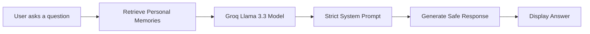
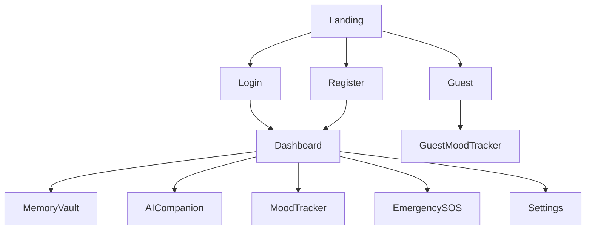

<div align="center">

# 🧠 YaadNama AI

### *Your Intelligent Memory Companion*


**A compassionate AI-powered memory assistant designed for people living with memory challenges.**

---


<br>


</div>

---

# 📖 About YaadNama

> **"YaadNama" (یادنامہ) means "Memory Journal."**

YaadNama AI is a private, intelligent memory companion designed for individuals experiencing memory challenges, including:

- 🧠 Early Alzheimer's Disease
- 💙 Mild Cognitive Impairment (MCI)
- 🩺 Brain Injury Recovery
- 📅 Everyday Memory Overload

Instead of forcing users to remember **where** they saved information, YaadNama allows them to simply **ask naturally**.

Examples:

> 👤 "Who is Ahmed?"

> 💊 "When should I take my medicine?"

> 🏠 "Where did I leave my glasses?"

The AI answers **only from the memories the user has personally saved**—never guessing or inventing information.

---

# 🎯 Problem & Solution

## ❌ The Problem

People experiencing memory decline don't just forget facts—they gradually lose confidence in their independence.

Traditional note-taking applications assume users remember:

- where information was saved,
- what it was called,
- how to search for it.

Unfortunately, those are often the exact abilities affected by memory decline.

Common alternatives like:

- Sticky Notes
- Whiteboards
- Paper Diaries
- Standard Note Apps

can become frustrating because they require remembering where information was stored.

---

## ✅ The Solution

**YaadNama AI changes the experience completely.**

Instead of searching through notes...

Users simply ask naturally.

The AI searches their personal Memory Vault and responds using **only** their saved information.

If something hasn't been recorded yet, YaadNama honestly says so and gently encourages the user to save it.

This creates a compassionate, trustworthy assistant that supports independence while respecting user privacy.

---

# ❤️ Built For

- 👴 Early-stage Dementia
- 🧠 Mild Memory Impairment
- 🩺 Brain Injury Recovery
- 👨‍👩‍👧 Family Members & Caregivers
- 📚 Anyone who struggles with remembering important information

---

# ✨ Key Highlights

| Feature | Description |
|----------|-------------|
| 🧠 AI Memory Companion | Chat naturally with your memories |
| 📂 Memory Vault | Store important life information |
| 😊 Mood Tracker | Monitor emotional wellbeing |
| 🚨 Emergency SOS | Quick access to emergency contacts |
| 🔒 Privacy First | AI never guesses or invents memories |
| 🌐 Demo Mode | Full testing without Supabase |
| 👤 Guest Mode | Mood tracking without an account |
| 📱 Accessible Design | Built for low cognitive load and low vision |

---
# ✨ Core Features

<table>
<tr>
<td width="50%">

### 🔐 Authentication System

Secure and flexible authentication for every type of user.

✅ Create Account

✅ Secure Sign In

✅ Continue as Guest

✅ Demo Mode (No Supabase Required)

</td>

<td width="50%">

### 📂 Memory Vault

Organize life's important moments with ease.

- 👨‍👩‍👧 Family
- 🤝 Friends
- 📅 Important Events
- 📍 Places
- 💊 Medications
- 📝 Personal Notes
- 🎂 Important Dates
- ❤️ Favorite Things
- 🔍 Lost Items

Each memory includes:

- Title
- Description
- Date
- Tags
- AI-generated Summary

</td>
</tr>

<tr>
<td>

### 🤖 AI Memory Companion

Ask questions naturally instead of searching manually.

Examples:

> "Who is Ahmed?"

> "Where did I leave my glasses?"

> "When is my next appointment?"

### The AI

✅ Uses only your saved memories

✅ Never invents information

✅ Maintains chat history

✅ Gives honest responses when information doesn't exist

</td>

<td>

### 😊 Mood Tracker

Track emotional wellbeing with a clean and calming interface.

Available moods:

😊 Happy

😌 Calm

😢 Sad

😟 Confused

😰 Anxious

😴 Tired

Features:

- Daily mood logging
- Optional notes
- 7-Day trend visualization
- Guest mood tracking
- Authenticated mood history

</td>
</tr>

<tr>
<td>

### 🚨 Emergency SOS

Designed for quick access during emergencies.

Features:

- One-tap calling
- Emergency contact storage
- Large accessible emergency button
- Instant access to first emergency contact

</td>

<td>

### 🔒 Privacy & Security

Your memories remain yours.

✔ Private by Design

✔ User-scoped storage

✔ Guest data isolation

✔ Secure Authentication

✔ AI receives only necessary memory context

✔ No data shared between users

</td>
</tr>
</table>

---

# 🤖 AI Features

## 🧠 Intelligent Memory Companion

The heart of YaadNama AI is its intelligent Memory Companion.

Rather than acting like a traditional chatbot, the AI behaves as a trusted memory assistant.

When a user asks a question:

1. Their saved memories are collected.
2. The user's question is added.
3. Both are securely sent to the Groq-hosted Llama model.
4. A strict system prompt prevents hallucinations.
5. The AI responds only using recorded memories.

If information does not exist, it politely explains that it hasn't yet been recorded.

---

## ✨ AI Auto Summaries

Every saved memory automatically receives an AI-generated summary.

Benefits:

- Faster browsing
- Cleaner dashboard
- Easier searching
- Better accessibility

The summaries are:

✅ Short

✅ Friendly

✅ Based only on user-written information

✅ Never fabricated

---

# 🧠 AI Workflow



---

# 🏗️ Application Architecture

```mermaid
flowchart TD

User

User --> NextJS

NextJS --> Authentication

NextJS --> Memory Vault

NextJS --> Mood Tracker

NextJS --> Emergency SOS

Memory Vault --> LocalStorage

Authentication --> Supabase

NextJS --> AI API

AI API --> Groq Llama Model
```

---

# ⚙️ Technology Stack

| Category | Technology |
|------------|------------|
| 🎨 Frontend | Next.js 14 (App Router) |
| ⚛️ UI Library | React 18 |
| 🎨 Styling | Tailwind CSS |
| 🔐 Authentication | Supabase Authentication |
| 💾 Data Storage | Browser LocalStorage |
| 🤖 AI Model | Groq Llama 3.3 70B Versatile |
| 🔌 API | Next.js Server API |
| ☁️ Deployment | Vercel |
| 📂 Version Control | GitHub |

---

# 📸 Application Modules

| Module | Purpose |
|---------|----------|
| 🏠 Dashboard | User overview and statistics |
| 📂 Memory Vault | Save and organize memories |
| 🤖 AI Companion | Natural language memory retrieval |
| 😊 Mood Tracker | Emotional wellbeing tracking |
| 🚨 Emergency SOS | Emergency contacts |
| ⚙️ Settings | User preferences |
| 🔐 Authentication | Secure login & registration |

---

# 🌟 Why YaadNama?

Unlike ordinary note-taking applications, YaadNama focuses on **memory accessibility rather than memory storage.**

Instead of remembering where information was saved...

Users simply remember how to ask.

That simple difference makes YaadNama a compassionate assistant rather than just another notes application.

---
# 🚀 Getting Started

Follow these steps to run YaadNama AI on your local machine.

---

## 📋 Prerequisites

Before getting started, make sure you have:

- ✅ Node.js 18+
- ✅ npm
- ✅ A free Groq API Key
- ✅ (Optional) Supabase Project

---

## 📦 Installation

```bash
# Clone the repository
git clone <your-repository-url>

# Navigate to the project
cd yaadnama

# Install dependencies
npm install

# Copy environment variables
cp .env.example .env.local

# Start development server
npm run dev
```

Visit:

```
http://localhost:3001
```

---

# 🔑 Environment Variables

Create a `.env.local` file inside the project root.

```env
# Required
GROQ_API_KEY=your_groq_api_key

# Optional (Production Authentication)
NEXT_PUBLIC_SUPABASE_URL=your_project_url
NEXT_PUBLIC_SUPABASE_ANON_KEY=your_project_key
```

> **Note:** The application works completely in **Demo Mode** without Supabase.

---

# 📂 Project Structure

```text
yaadnama/
│
├── app/
│   ├── api/
│   │   └── ai/
│   ├── dashboard/
│   ├── memories/
│   ├── companion/
│   ├── mood/
│   ├── emergency/
│   ├── login/
│   ├── register/
│   ├── settings/
│   ├── globals.css
│   ├── layout.js
│   └── page.js
│
├── components/
│   ├── Nav.js
│   ├── RequireProfile.js
│   └── SettingsProvider.js
│
├── lib/
│   ├── auth.js
│   ├── storage.js
│   ├── demo.js
│   └── supabase.js
│
├── screenshots/
│
├── public/
│
├── .env.example
├── package.json
└── README.md
```

---

# 🔐 Authentication Flow



---

# 💾 Data Storage Architecture

Every user's information is isolated.

```
Authenticated User

yaadnama_memories_email

yaadnama_moods_email

yaadnama_chatHistory_email
```

Guest Mode

```
yaadnama_moods_guest
```

### Privacy Features

- ✅ Separate data for every user
- ✅ Guest data never mixes with authenticated users
- ✅ Local storage persists across sessions
- ✅ AI accesses only relevant memory data
- ✅ Privacy-first architecture

---

# 🎮 Demo Mode

YaadNama includes a fully functional Demo Mode.

### Features

- Login with any email
- No Supabase required
- Save memories
- Chat with AI
- Track moods
- Persistent LocalStorage
- Full application experience

Perfect for testing and demonstrations.

---

# ☁️ Deploy to Vercel

Deploying YaadNama is simple.

1. Push the project to GitHub.
2. Import the repository into Vercel.
3. Configure environment variables.
4. Deploy.

Required Variables

```
GROQ_API_KEY

NEXT_PUBLIC_SUPABASE_URL

NEXT_PUBLIC_SUPABASE_ANON_KEY
```

⚠️ Never commit API keys to GitHub.

---

# 📸 Screenshots

Replace these placeholders with actual screenshots.

| Landing Page | Dashboard |
|--------------|-----------|
|  |  |

| Memory Vault | AI Companion |
|---------------|--------------|
|  |  |

| Mood Tracker | Emergency SOS |
|---------------|---------------|
|  |  |

---

# 🛣️ Future Roadmap

- [ ] Caregiver Portal
- [ ] Voice Assistant
- [ ] Speech-to-Text Memory Saving
- [ ] Text-to-Speech Responses
- [ ] Medication Notifications
- [ ] Smart Appointment Reminders
- [ ] Cloud Synchronization
- [ ] AI Daily Journal
- [ ] Mobile Application
- [ ] Multi-language Support

---

# 🐞 Troubleshooting

| Issue | Solution |
|--------|----------|
| App won't start | Verify Node.js version and reinstall dependencies |
| AI isn't responding | Check `GROQ_API_KEY` in `.env.local` |
| Login issues | Ensure Demo Mode is enabled or Supabase credentials are correct |
| Data missing | Verify LocalStorage and browser permissions |
| Guest data unavailable | Open the Guest Mood Tracker page |

---

# 📈 Performance

YaadNama is designed with performance and accessibility in mind.

- ⚡ Fast Next.js App Router
- 🔒 Secure server-side API handling
- 🧠 AI-powered memory retrieval
- 💾 Offline-friendly LocalStorage
- ♿ Accessible UI with low cognitive load
- 🌙 High-contrast and readable interface

---

# 🤝 Contributing

Contributions are welcome!

1. Fork the repository.
2. Create a feature branch.

```bash
git checkout -b feature/YourFeature
```

3. Commit your changes.

```bash
git commit -m "Add amazing feature"
```

4. Push the branch.

```bash
git push origin feature/YourFeature
```

5. Open a Pull Request.

---

# 📄 License

This project is licensed under the **MIT License**.

---

# 💙 Acknowledgements

Special thanks to the amazing open-source technologies that made this project possible.

- Next.js
- React
- Tailwind CSS
- Groq
- Supabase
- Vercel

---

<div align="center">

# 🧠 YaadNama AI

### *Helping people remember what matters most.*

---

**Built with ❤️ for individuals living with memory challenges.**

If you found this project helpful, consider giving it a ⭐ on GitHub.

### Thank you for visiting!

</div>


