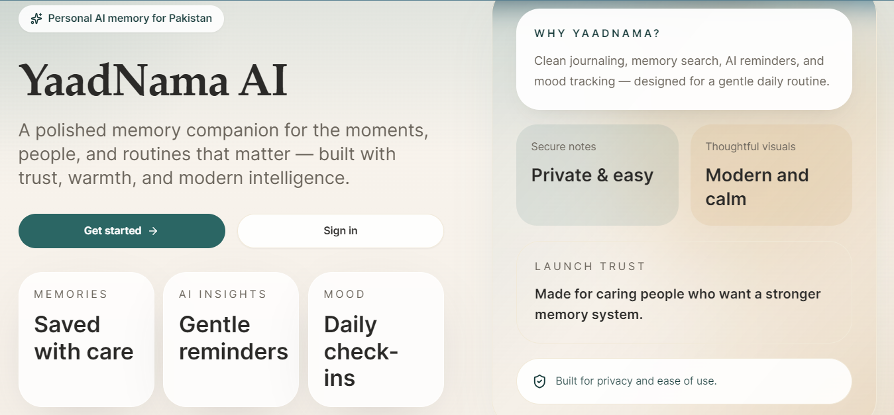

# YaadNama AI (یادنامہ) — Your Intelligent Memory Companion

> **YaadNama** means *"memory journal"* in Urdu. It's a private, gentle place for people with memory challenges to save the people, places, medications, and moments that matter — and ask for them back, in plain language, whenever they need to.

**An original, individually-built final project.** Not a template, not a tutorial clone.

---

## 🔗 Live Demo

**[👉 Try YaadNama AI live here](https://your-app-name.vercel.app)** 

<!--
  TODO (required before submission):
  Replace the link above with your actual deployed Vercel/hosting URL.
  Test it yourself in an incognito window first — graders will open and use it directly.
-->

**GitHub Repository:** `https://github.com/<your-username>/yaadnama` 
<!-- TODO: replace with your actual public repo URL -->

---

## 📖 Table of Contents

- [The Problem](#-the-problem)
- [The Solution](#-the-solution)
- [Screenshots](#-screenshots)
- [Features](#-features)
- [The AI Feature](#-the-ai-feature)
- [Tech Stack](#-tech-stack)
- [Authentication Architecture](#-authentication-architecture)
- [Data Storage & Scoping](#-data-storage--scoping)
- [Getting Started](#-getting-started)
- [Deploying to Vercel](#-deploying-to-vercel)
- [Project Structure](#-project-structure)
- [Validation Checklist](#-validation-checklist)
- [Troubleshooting](#-troubleshooting)
- [Future Roadmap](#-future-roadmap)
- [License](#-license)

---

## 🎯 The Problem

People experiencing memory decline — through early Alzheimer's, mild cognitive decline, or brain-injury recovery — don't just forget facts. They lose confidence in their own independence.

Sticky notes get lost. Whiteboards get erased. Family members end up re-explaining the same things every single day. And the note-taking apps built to help actually make things worse: they assume you remember *where you filed something* and *how to search for it* — which is exactly the skill that's failing.

**Built for:** individuals with mild memory impairment, early-stage dementia, or brain-injury-related memory loss — and the family members who support them.

## 💡 The Solution

YaadNama lets people **talk to their own memories** instead of searching for them.

You save something once, in your own words, in a calm interface built for low-vision and low-cognitive-load use. Later, you simply ask:

- *"Who is Ahmed?"*
- *"Where did I leave my glasses?"*
- *"What medication do I take in the mornings?"*

The app answers **only from what you actually saved** — never guessing, never inventing.

---

## 📸 Screenshots

<!--
  TODO (required before submission — minimum 3 screenshots):
  1. Create a /screenshots folder in your repo root.
  2. Add real screenshots of your running app (landing page, dashboard, memory vault, AI companion chat, mood tracker, etc.).
  3. Replace the paths below with the actual filenames.
-->

| Landing / Sign In | Dashboard | Memory Vault |
|---|---|---|
|  |  |  |

| AI Companion Chat | Mood Tracker | Emergency SOS |
|---|---|---|
|  |  |  |

---

## ✨ Features

### Authentication System
- **Create Account** — secure email/password registration with validation
- **Sign In** — authenticated access to a personal memory vault
- **Continue as Guest** — try mood tracking with no account needed
- **Demo Mode** — test the full app locally without any Supabase credentials

### Memory Vault
- Save memories under **9 categories**: Family, Friends, Important Events, Places, Medications, Personal Notes, Important Dates, Favorite Things, Lost Items
- Each memory stores a title, description, date, and optional tags
- Automatic AI-generated one-line summary for every memory
- Full-text search and category filtering
- Easy edit and delete functionality

### AI Memory Companion
- Chat interface for natural-language questions about saved memories
- Answers **strictly** from the user's personal vault — never guesses or invents
- Gives an honest response when information hasn't been recorded, and invites the user to save it
- Full chat history persists across sessions

### Mood Tracker
- **Authenticated mood tracking** — log moods (Happy, Calm, Sad, Confused, Anxious, Tired) with optional notes
- **Guest mood tracking** — anonymous check-ins, no login required
- 7-day trend visualization of mood patterns
- Timestamped entries, completely independent from authenticated user data

### Dashboard
- Warm, welcoming greeting
- Quick stats: memory vault count, today's mood, recent entries
- Quick navigation to every main feature
- At-a-glance overview of saved memories

### Emergency SOS
- Store emergency contacts with one-tap calling
- Large, easy-to-access crisis button
- Instant access to the first emergency contact

### Data Privacy & Persistence
- Secure email/password authentication via Supabase (or Demo Mode for testing)
- User data scoped to individual accounts — **no data mixing between users**
- Guest data fully separated from authenticated accounts
- Private by design: only the user's *question* is sent to the AI, never the full database

---

## 🤖 The AI Feature

The **AI Memory Companion** is the core intelligent feature of the app. When a user asks a question, the app sends their saved Memory Vault plus their question to a Groq-hosted Llama model, governed by a strict, self-authored system prompt that forces the model to answer only from what the user has recorded — never to invent people, dates, or facts.

**Model used:** `llama-3.3-70b-versatile` via Groq's OpenAI-compatible API 
**Called from:** a server-side Next.js API route (`/api/ai`), so the API key is never exposed to the browser.

#### System Prompt — Memory Companion

```
You are YaadNama AI, a compassionate memory companion.
Your purpose is to help users remember people, places, appointments, medications, routines, and important life events.
Always prioritize information stored in the user's personal memory database, which will be provided to you as a list of saved memories before each question.
Never invent or assume memories. Only answer using what is explicitly present in the provided memories.
If information does not exist in the provided memories, politely explain that it has not yet been recorded and invite the user to save it.
Speak gently, respectfully, and clearly. Keep responses concise (2-4 sentences) and encouraging.
Do not provide medical diagnoses or replace professional healthcare advice.
```

#### Secondary AI Behavior — Auto-Summaries

Every memory saved to the vault is automatically passed to the same model with an instruction to generate a **warm, one-line summary (under 18 words)** based strictly on what the user wrote — never invented, never embellished, never adding facts that weren't in the original entry.

**Why this matters:** for someone whose memory is already unreliable, an AI that "helpfully" fills in gaps or guesses is actively harmful. Both AI behaviors in this app are constrained, on purpose, to be *retrieval and summarization tools*, not creative or speculative ones.

---

## 🛠️ Tech Stack

| Component | Technology |
|---|---|
| Frontend Framework | Next.js 14 (App Router) + React 18 |
| Styling | Tailwind CSS (responsive, accessible design) |
| Authentication | Supabase (email/password) + Demo Mode (for testing) |
| Data Storage | Browser `localStorage`, scoped per user email |
| AI Model | Groq — `llama-3.3-70b-versatile` (OpenAI-compatible API) |
| API Routes | Next.js server-side API (`/api/ai`) — key never exposed to the client |
| Hosting | Vercel |
| Version Control | GitHub |

---

## 🔐 Authentication Architecture

**Sign Up Flow**
1. User clicks "Create Account" on the landing page
2. Enters email and password, with validation
3. *Demo Mode:* user is stored in `localStorage` under `yaadnama_demo_user`
4. *Production:* user is registered via Supabase Auth
5. User is redirected to the Dashboard with full user context

**Sign In Flow**
1. User clicks "Sign In" or visits `/login`
2. Enters email and password
3. *Demo Mode:* user is retrieved from `localStorage`
4. *Production:* authenticated via Supabase with a JWT
5. Redirected to Dashboard

**Guest Flow**
1. User clicks "Continue as Guest"
2. Gains access to `/mood/guest` with no authentication
3. Can track moods freely — data is stored under a separate `guest` key, fully isolated from any authenticated account

**Protected vs. Public Routes**

| Route | Access |
|---|---|
| `/dashboard` | Requires authentication |
| `/memories` | Requires authentication |
| `/companion` | Requires authentication |
| `/mood` | Requires authentication |
| `/mood/guest` | Public — no auth needed |

---

## 💾 Data Storage & Scoping

**Authenticated user data** is namespaced as:
```
yaadnama_{feature}_{userEmail}
```
Examples: `yaadnama_memories_user@example.com`, `yaadnama_moods_user@example.com`, `yaadnama_chatHistory_user@example.com`

**Guest data** is namespaced separately as:
```
yaadnama_{feature}_guest
```

**Guarantees:**
- ✅ No data mixing between authenticated users
- ✅ Guest data fully isolated from account holders
- ✅ Each user has complete privacy by default
- ✅ Data persists across browser sessions
- ✅ Guest mood tracking can be used even while logged in as a different user

---

## 🚀 Getting Started

### Prerequisites
- Node.js 18+ and npm
- A free Groq API key → [console.groq.com/keys](https://console.groq.com/keys)

### Installation

```bash
# Clone the repository
git clone https://github.com/<your-username>/yaadnama.git
cd yaadnama

# Install dependencies
npm install

# Create your environment file
cp .env.example .env.local

# Add your Groq API key to .env.local
# (Supabase credentials are optional — the app runs fully in Demo Mode without them)

# Start the development server
npm run dev
```

Open **[http://localhost:3001](http://localhost:3001)** in your browser.

### Environment Variables

Create a `.env.local` file in the project root:

```bash
# Required: Groq API key (free from https://console.groq.com/keys)
GROQ_API_KEY=your_groq_api_key_here

# Optional: Supabase credentials (for production authentication)
NEXT_PUBLIC_SUPABASE_URL=your_supabase_project_url
NEXT_PUBLIC_SUPABASE_ANON_KEY=your_supabase_anon_key
```

> ⚠️ **Never commit API keys or secrets to GitHub.** They must only ever exist as environment variables, both locally (`.env.local`, which is git-ignored) and on your hosting provider.

### Testing Without Authentication (Demo Mode)

The app runs in **Demo Mode by default**, so it can be fully tested without any Supabase setup:

- **Demo login:** works with any email/password combination
- **Guest mood tracking:** fully functional with no login
- **All data:** stored in browser `localStorage`, persists across refreshes

### Switching to Production (Supabase)

1. Create a free account at [supabase.com](https://supabase.com)
2. From **Project Settings → API**, copy your **Project URL** and **Anon Key**
3. Add both to `.env.local`
4. In `lib/demo.js`, set:
   ```js
   export const DEMO_MODE = false;
   ```
5. Restart the dev server and create a real account from the login page

---

## ☁️ Deploying to Vercel

1. Push the repository to GitHub (must be **public**)
2. Go to [vercel.com](https://vercel.com) and sign in with GitHub
3. Click **Add New Project** and import the repository
4. Under **Project Settings → Environment Variables**, add:
   - `GROQ_API_KEY` *(required)*
   - `NEXT_PUBLIC_SUPABASE_URL` *(optional, for production auth)*
   - `NEXT_PUBLIC_SUPABASE_ANON_KEY` *(optional, for production auth)*
5. Click **Deploy** — Vercel will generate a live public URL

---

## 📁 Project Structure

```
yaadnama/
├── app/
│   ├── layout.js              # Root layout with nav and auth wrapper
│   ├── page.js                # Landing page (Sign In / Sign Up / Guest)
│   ├── globals.css            # Global styles
│   ├── api/
│   │   └── ai/route.js        # AI API endpoint (memory chat & summaries)
│   ├── login/page.js          # Sign In page
│   ├── register/page.js       # Create Account page
│   ├── dashboard/page.js      # Main dashboard (authenticated)
│   ├── memories/page.js       # Memory Vault (authenticated)
│   ├── companion/page.js      # AI Companion chat (authenticated)
│   ├── mood/page.js           # Mood Tracker (authenticated)
│   ├── mood/guest/page.js     # Guest Mood Tracker (public)
│   ├── emergency/page.js      # SOS Emergency Contacts
│   └── settings/page.js       # User Settings
├── components/
│   ├── Nav.js                 # Navigation header with auth
│   ├── RequireProfile.js      # Auth guard for protected routes
│   └── SettingsProvider.js    # Global settings context
├── lib/
│   ├── auth.js                # Supabase auth functions
│   ├── supabase.js            # Supabase client initialization
│   ├── storage.js             # localStorage wrapper with scoping
│   └── demo.js                # Demo mode flag
├── .env.local                 # Environment variables (not committed)
├── .env.example                # Example env file
└── package.json
```

---

## ✅ Validation Checklist

- [ ] Create account with email/password validation
- [ ] Sign in returns to dashboard with correct user email
- [ ] Add memory in authenticated account
- [ ] Memory persists after page refresh
- [ ] Add mood as authenticated user
- [ ] Mood data persists after refresh
- [ ] AI companion responds and retains chat history
- [ ] Guest mood tracking works without login
- [ ] Guest moods don't appear in authenticated account
- [ ] Sign out clears demo user from localStorage
- [ ] Demo mode works with zero Supabase credentials

---

## 🐛 Troubleshooting

| Issue | Solution |
|---|---|
| App stuck on loading | Check the browser console for errors, verify `GROQ_API_KEY` in `.env.local`, restart the dev server |
| Demo login not working | Verify `DEMO_MODE = true` in `lib/demo.js`; clear localStorage and refresh |
| Supabase auth failing | Confirm credentials in `.env.local`; restart dev server; check `DEMO_MODE = false` |
| Data not persisting | Check DevTools → Application → Local Storage; verify the correct email is being used; clear cache |
| Guest moods not saving | Ensure you're on `/mood/guest` (not `/mood`); check localStorage under `yaadnama_moods_guest` |
| Memories not showing in companion | Ensure memories are saved in the authenticated account — the AI can only see that account's vault |

---

## 🗺️ Future Roadmap

This is an MVP built to demonstrate a real, working, end-to-end solution. Planned additions:

- **Caregiver Portal** — permissioned shared access for family members
- **Voice Features** — speech-to-text input and text-to-speech output
- **Smart Reminders** — medication alerts and appointment notifications
- **Cross-Device Sync** — real cloud database backend (currently localStorage-only)
- **AI Journal** — auto-generated daily life narratives from all recorded activity

---

## 📄 License

<!-- TODO: choose and add a license, e.g. MIT -->
This project is submitted as an individual academic final project.

---

## 🙏 About This Project

YaadNama AI was designed and built end-to-end as an original solution to a real problem faced by people living with memory challenges and the families who support them. It is not a template, tutorial clone, or derivative of an existing project.

**Questions or feedback?** Open an issue on the GitHub repository above.

*Built with care.*
