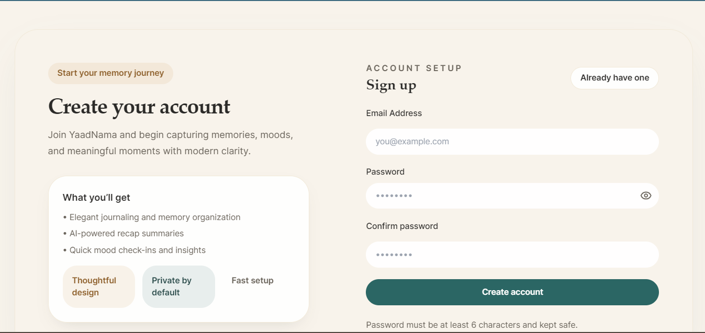
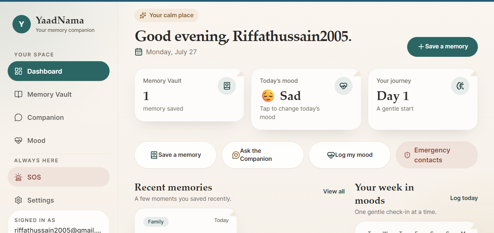
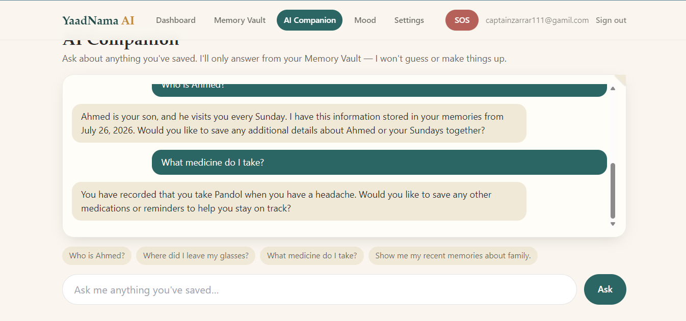
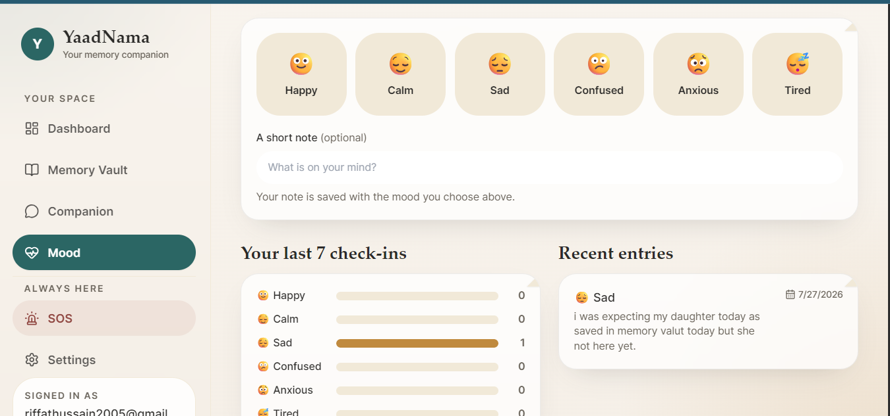
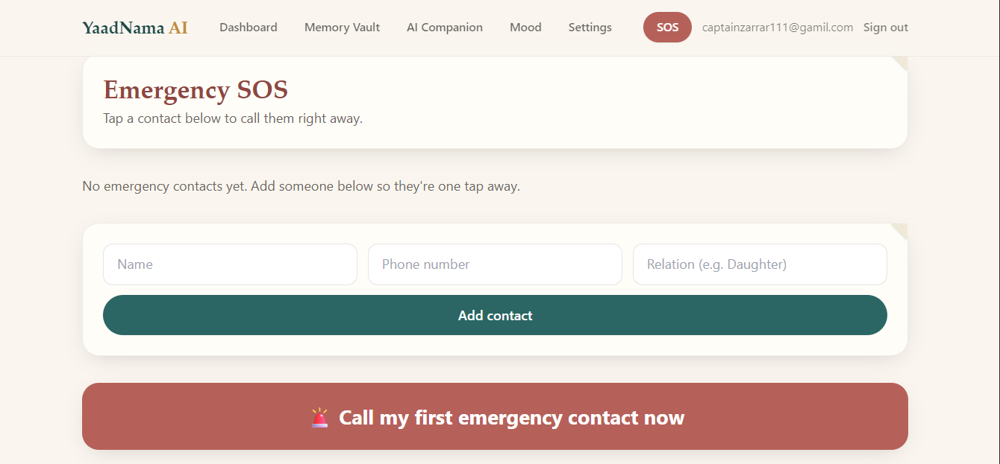
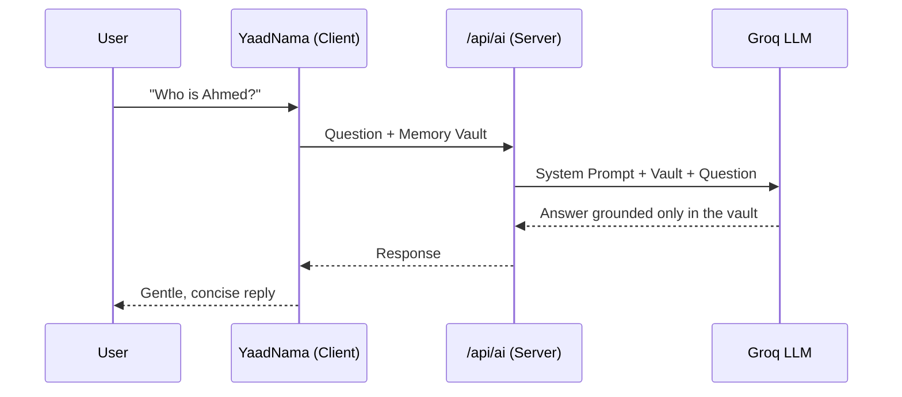
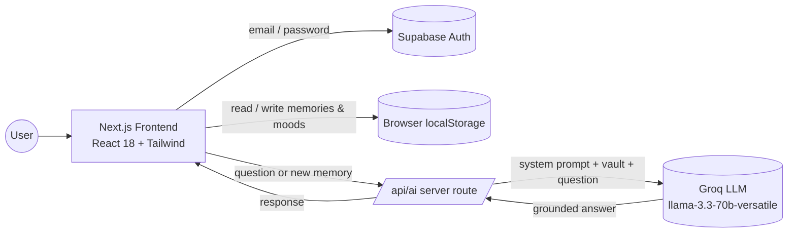
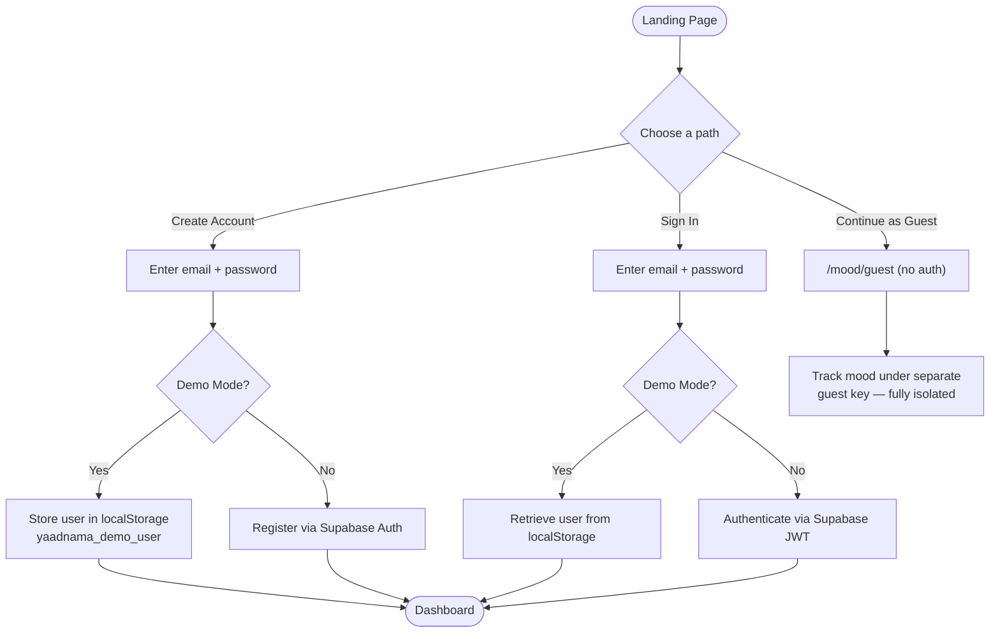

<div align="center">

# 🧠 YaadNama AI

### یادنامہ

#### *Your Intelligent Memory Companion*


<br><br>

**Helping people remember what matters most.**

</div>

---

> **YaadNama** *(یادنامہ)* — **"Memory Journal"** in Urdu — is a secure AI-powered memory companion created for individuals experiencing memory challenges. Users can safely store important people, places, medications, events, and personal notes, then retrieve them later through simple, natural conversations.

> 🎓 **Original Individual Project**
>
> Designed, developed, and deployed independently as a complete end-to-end AI application.  
> **Not** a template. **Not** a tutorial clone.

---

<div align="center">

## 🌐 Live Demo

### 🚀 **Experience YaadNama AI**

<a href="https://yaad-nama-ai.vercel.app">
  
</a>

<p><i>Hosted on Vercel and publicly accessible for evaluation.</i></p>

</div>

---

<div align="center">

# 📚 Table of Contents

| |
|:---:|
| 🏠 [Overview](#-yaadnama-ai-یادنامہ--your-intelligent-memory-companion) |
| 🌐 [Live Demo](#-live-demo) |
| 🎯 [The Problem](#-the-problem) |
| 💡 [The Solution](#-the-solution) |
| 📸 [Screenshots](#-screenshots) |
| ✨ [Feature Showcase](#-feature-showcase) |
| 🤖 [The AI Feature](#-the-ai-feature) |
| 🛠️ [Tech Stack](#️-tech-stack) |
| 🔐 [Authentication Architecture](#-authentication-architecture) |
| 💾 [Data Storage & Scoping](#-data-storage--scoping) |
| 🚀 [Getting Started](#-getting-started) |
| ☁️ [Deploying to Vercel](#️-deploying-to-vercel) |
| 📁 [Project Structure](#-project-structure) |
| ✅ [Validation Checklist](#-validation-checklist) |
| 🛠️ [Troubleshooting](#️-troubleshooting) |
| 🔮 [Future Roadmap](#-future-roadmap) |
| 📄 [License](#-license) |

</div>

---

<div align="center">

## 🎯 The Problem

</div>

People experiencing memory decline — through early Alzheimer's, mild cognitive decline, or brain-injury recovery — don't just forget facts. They lose confidence in their own independence.

Sticky notes get lost. Whiteboards get erased. Family members end up re-explaining the same things every single day. And the note-taking apps built to help actually make things worse: they assume you remember *where you filed something* and *how to search for it* — which is exactly the skill that's failing.

**Built for:** individuals with mild memory impairment, early-stage dementia, or brain-injury-related memory loss — and the family members who support them.

<div align="center">

## 💡 The Solution

</div>

YaadNama lets people **talk to their own memories** instead of searching for them.

You save something once, in your own words, in a calm interface built for low-vision and low-cognitive-load use. Later, you simply ask:

- *"Who is Ahmed?"*
- *"Where did I leave my glasses?"*
- *"What medication do I take in the mornings?"*

The app answers **only from what you actually saved** — never guessing, never inventing.

---

## 📸 Screenshots

<!--
  TODO (required before submission — minimum 3 screenshots):
  1. Create a /screenshots folder in your repo root.
  2. Add real screenshots of your running app (landing page, dashboard, memory vault, AI companion chat, mood tracker, etc.).
  3. Replace the paths below with the actual filenames.
-->

<div align="center">

# 📸 Application Showcase

### *A visual walkthrough of YaadNama AI*

Explore the key screens of the application, from authentication to AI-powered memory assistance.

<br>

<table>
<tr>
<td align="center" width="33%">



**🏠 Landing / Sign In**

</td>

<td align="center" width="33%">



**📊 Dashboard**

</td>

<td align="center" width="33%">


**🗂️ Memory Vault**

</td>
</tr>

<tr>
<td align="center">



**🤖 AI Memory Companion**

</td>

<td align="center">



**😊 Mood Tracker**

</td>

<td align="center">



**🆘 Emergency SOS**

</td>
</tr>
</table>

<i>✨ Every screen was designed and implemented specifically for YaadNama AI as part of this original end-to-end final project.</i>

</div>

---

<div align="center">

# ✨ Feature Showcase

*Discover the complete set of thoughtfully designed features that make **YaadNama AI** a secure, intelligent, and compassionate memory companion.*

</div>

---

<div align="center">

## 🔐 Secure Authentication System

</div>

- **Create Account** — Secure email/password registration with validation.
- **Sign In** — Authenticated access to a personal memory vault.
- **Continue as Guest** — Try mood tracking with no account needed.
- **Demo Mode** — Test the full app locally without any Supabase credentials.

---

<div align="center">

## 🗂️ Intelligent Memory Vault

</div>

- Save memories under **9 categories**:
  - 👨‍👩‍👧 Family
  - 🤝 Friends
  - 🎉 Important Events
  - 📍 Places
  - 💊 Medications
  - 📝 Personal Notes
  - 📅 Important Dates
  - ❤️ Favorite Things
  - 🔍 Lost Items
- Each memory stores a title, description, date, and optional tags.
- Automatic AI-generated one-line summary for every memory.
- Full-text search and category filtering.
- Easy edit and delete functionality.

---

<div align="center">

## 🤖 AI-Powered Memory Companion

</div>

- Chat interface for natural-language questions about saved memories.
- Answers strictly from the user's personal vault — **never guesses or invents**.
- Gives an honest response when information hasn't been recorded and invites the user to save it.
- Full chat history persists across sessions.

---

<div align="center">

## 😊 Mood & Well-being Tracker

</div>

- Authenticated mood tracking — log moods (**Happy, Calm, Sad, Confused, Anxious, Tired**) with optional notes.
- Guest mood tracking — anonymous check-ins with no login required.
- 7-day trend visualization of mood patterns.
- Timestamped entries, completely independent from authenticated user data.

---

<div align="center">

## 📊 Personalized Dashboard

</div>

- Warm, welcoming greeting.
- Quick stats: memory vault count, today's mood, recent entries.
- Quick navigation to every main feature.
- At-a-glance overview of saved memories.

---

<div align="center">

## 🚨 Emergency SOS

</div>

- Store emergency contacts with one-tap calling.
- Large, easy-to-access crisis button.
- Instant access to the first emergency contact.

---

<div align="center">

## 🔒 Privacy, Security & Data Persistence

</div>

- Secure email/password authentication via **Supabase** (or **Demo Mode** for testing).
- User data scoped to individual accounts — no data mixing between users.
- Guest data fully separated from authenticated accounts.
- Private by design: only the user's question is sent to the AI, never the full database.

---

<div align="center">

# 🤖 AI Memory Companion

*The intelligence behind **YaadNama AI** is carefully designed to be trustworthy, privacy-conscious, and grounded entirely in the user's own memories.*

</div>

---

<div align="center">

## 🧠 Core AI Capability

</div>

The **AI Memory Companion** is the core intelligent feature of the application. When a user asks a question, the app sends the user's saved **Memory Vault** together with their question to a **Groq-hosted Llama model**, governed by a **strict, self-authored system prompt** that forces the model to answer **only from what the user has recorded**—never to invent people, dates, or facts.

### ⚙️ AI Configuration

| Component | Details |
|-----------|---------|
| **Model** | `llama-3.3-70b-versatile` |
| **Provider** | Groq |
| **API** | OpenAI-Compatible API |
| **Server Route** | `/api/ai` (Next.js API Route) |
| **Security** | API key remains server-side and is never exposed to the browser |

---

<div align="center">

## 🔄 AI Request Flow

</div>



---

<div align="center">

## 🛠️ Tech Stack

</div>

| Component | Technology |
| :-------------------- | :----------------------------------------------------------------------- |
| Frontend Framework | Next.js 14 (App Router) + React 18 |
| Styling | Tailwind CSS (responsive, accessible design) |
| Authentication | Supabase (email/password) + Demo Mode (for testing) |
| Data Storage | Browser `localStorage`, scoped per user email |
| AI Model | Groq — `llama-3.3-70b-versatile` (OpenAI-compatible API) |
| API Routes | Next.js server-side API (`/api/ai`) — key never exposed to the client |
| Hosting | Vercel |
| Version Control | GitHub |

### 🏗️ System Architecture



---

<div align="center">

## 🔐 Authentication Architecture

</div>



**Protected vs. Public Routes**

| Route         | Access                     |
| :------------- | :--------------------------- |
| `/dashboard`  | Requires authentication   |
| `/memories`   | Requires authentication   |
| `/companion`  | Requires authentication   |
| `/mood`       | Requires authentication   |
| `/mood/guest` | Public — no auth needed   |

---

<div align="center">

## 💾 Data Storage & Scoping

</div>

**Authenticated user data** is namespaced as:
```
yaadnama_{feature}_{userEmail}
```
Examples: `yaadnama_memories_user@example.com`, `yaadnama_moods_user@example.com`, `yaadnama_chatHistory_user@example.com`

**Guest data** is namespaced separately as:
```
yaadnama_{feature}_guest
```

**Guarantees:**
- ✅ No data mixing between authenticated users
- ✅ Guest data fully isolated from account holders
- ✅ Each user has complete privacy by default
- ✅ Data persists across browser sessions
- ✅ Guest mood tracking can be used even while logged in as a different user

---

<div align="center">

## 🚀 Getting Started

</div>

### Prerequisites
- Node.js 18+ and npm
- A free Groq API key → [console.groq.com/keys](https://console.groq.com/keys)

### Installation

```bash
# Clone the repository
git clone https://github.com/<your-username>/yaadnama.git
cd yaadnama

# Install dependencies
npm install

# Create your environment file
cp .env.example .env.local

# Add your Groq API key to .env.local
# (Supabase credentials are optional — the app runs fully in Demo Mode without them)

# Start the development server
npm run dev
```

Open **[http://localhost:3001](http://localhost:3001)** in your browser.

### Environment Variables

Create a `.env.local` file in the project root:

```bash
# Required: Groq API key (free from https://console.groq.com/keys)
GROQ_API_KEY=your_groq_api_key_here

# Optional: Supabase credentials (for production authentication)
NEXT_PUBLIC_SUPABASE_URL=your_supabase_project_url
NEXT_PUBLIC_SUPABASE_ANON_KEY=your_supabase_anon_key
```

> ⚠️ **Never commit API keys or secrets to GitHub.** They must only ever exist as environment variables, both locally (`.env.local`, which is git-ignored) and on your hosting provider.

### Testing Without Authentication (Demo Mode)

The app runs in **Demo Mode by default**, so it can be fully tested without any Supabase setup:

- **Demo login:** works with any email/password combination
- **Guest mood tracking:** fully functional with no login
- **All data:** stored in browser `localStorage`, persists across refreshes

### Switching to Production (Supabase)

1. Create a free account at [supabase.com](https://supabase.com)
2. From **Project Settings → API**, copy your **Project URL** and **Anon Key**
3. Add both to `.env.local`
4. In `lib/demo.js`, set:
   ```js
   export const DEMO_MODE = false;
   ```
5. Restart the dev server and create a real account from the login page

---

<div align="center">

## ☁️ Deploying to Vercel

</div>

1. Push the repository to GitHub (must be **public**)
2. Go to [vercel.com](https://vercel.com) and sign in with GitHub
3. Click **Add New Project** and import the repository
4. Under **Project Settings → Environment Variables**, add:
   - `GROQ_API_KEY` *(required)*
   - `NEXT_PUBLIC_SUPABASE_URL` *(optional, for production auth)*
   - `NEXT_PUBLIC_SUPABASE_ANON_KEY` *(optional, for production auth)*
5. Click **Deploy** — Vercel will generate a live public URL

---

<div align="center">

## 📁 Project Structure

</div>

```
yaadnama/
├── app/
│   ├── layout.js              # Root layout with nav and auth wrapper
│   ├── page.js                # Landing page (Sign In / Sign Up / Guest)
│   ├── globals.css            # Global styles
│   ├── api/
│   │   └── ai/route.js        # AI API endpoint (memory chat & summaries)
│   ├── login/page.js          # Sign In page
│   ├── register/page.js       # Create Account page
│   ├── dashboard/page.js      # Main dashboard (authenticated)
│   ├── memories/page.js       # Memory Vault (authenticated)
│   ├── companion/page.js      # AI Companion chat (authenticated)
│   ├── mood/page.js           # Mood Tracker (authenticated)
│   ├── mood/guest/page.js     # Guest Mood Tracker (public)
│   ├── emergency/page.js      # SOS Emergency Contacts
│   └── settings/page.js       # User Settings
├── components/
│   ├── Nav.js                 # Navigation header with auth
│   ├── RequireProfile.js      # Auth guard for protected routes
│   └── SettingsProvider.js    # Global settings context
├── lib/
│   ├── auth.js                # Supabase auth functions
│   ├── supabase.js            # Supabase client initialization
│   ├── storage.js             # localStorage wrapper with scoping
│   └── demo.js                # Demo mode flag
├── .env.local                 # Environment variables (not committed)
├── .env.example                # Example env file
└── package.json
```

---

<div align="center">

## ✅ Validation Checklist

</div>

- [ ] Create account with email/password validation
- [ ] Sign in returns to dashboard with correct user email
- [ ] Add memory in authenticated account
- [ ] Memory persists after page refresh
- [ ] Add mood as authenticated user
- [ ] Mood data persists after refresh
- [ ] AI companion responds and retains chat history
- [ ] Guest mood tracking works without login
- [ ] Guest moods don't appear in authenticated account
- [ ] Sign out clears demo user from localStorage
- [ ] Demo mode works with zero Supabase credentials

---

<div align="center">

## 🐛 Troubleshooting

</div>

| Issue                              | Solution                                                                                             |
| :----------------------------------- | :------------------------------------------------------------------------------------------------------ |
| App stuck on loading               | Check the browser console for errors, verify `GROQ_API_KEY` in `.env.local`, restart the dev server  |
| Demo login not working             | Verify `DEMO_MODE = true` in `lib/demo.js`; clear localStorage and refresh                            |
| Supabase auth failing              | Confirm credentials in `.env.local`; restart dev server; check `DEMO_MODE = false`                    |
| Data not persisting                | Check DevTools → Application → Local Storage; verify the correct email is being used; clear cache    |
| Guest moods not saving             | Ensure you're on `/mood/guest` (not `/mood`); check localStorage under `yaadnama_moods_guest`         |
| Memories not showing in companion  | Ensure memories are saved in the authenticated account — the AI can only see that account's vault    |

---

<div align="center">

## 🗺️ Future Roadmap

</div>

This is an MVP built to demonstrate a real, working, end-to-end solution. Planned additions:

- **Caregiver Portal** — permissioned shared access for family members
- **Voice Features** — speech-to-text input and text-to-speech output
- **Smart Reminders** — medication alerts and appointment notifications
- **Cross-Device Sync** — real cloud database backend (currently localStorage-only)
- **AI Journal** — auto-generated daily life narratives from all recorded activity

---

<div align="center">

# 📜 License

This project is submitted as an **individual academic final project**.

*No open-source license has been applied at this time.*

</div>

---

<div align="center">

# 💙 About YaadNama AI

*"Helping people remember what matters most."*

</div>

**YaadNama AI** was conceived, designed, developed, and deployed entirely by the author as an original end-to-end AI application. Inspired by the real challenges faced by individuals experiencing memory loss and the families who support them, the project combines compassionate design with modern AI to create a secure, intelligent memory companion.

Every aspect of the application—from the user experience and authentication flow to the AI-powered Memory Companion and deployment—was built specifically for this project.

<div align="center">

### 🌟 Thank you for taking the time to explore YaadNama AI.

If you have any questions, suggestions, or feedback, feel free to **open an issue** on this GitHub repository.

**Built with ❤️, empathy, and AI.**

</div>

</div>
